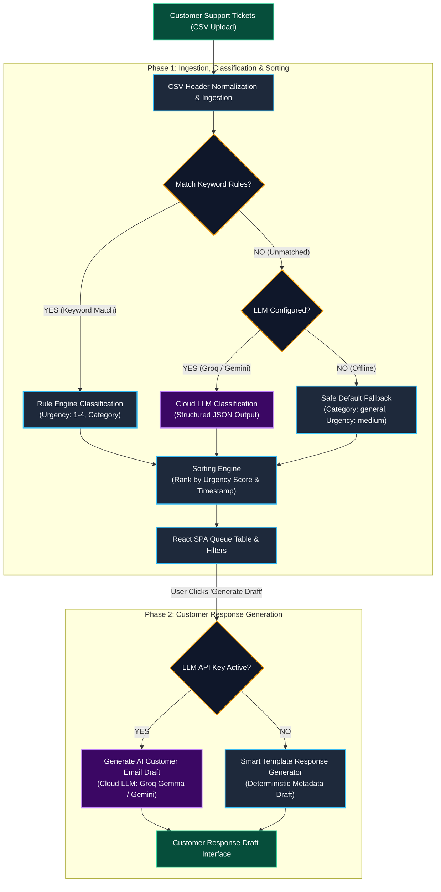

# Pursuit: /CYCLE-02/WEEK-03-and-04/SUPPORT-SPECIALIST-MVP

**Stop triaging tickets by hand. Start responding to customers.**

Support teams at mid-size SaaS companies spend the first hour of every morning reading through
hundreds of tickets, deciding what's urgent, and sorting them into buckets — before they even
start helping anyone. TechFlow Support Queue reads the queue for you, flags what's critical,
categorizes the rest, and puts the most urgent tickets at the top of the pile so you can skip
straight to resolving problems.

> The name: TechFlow is the fictional SaaS company Jordan M. works at. The queue is the
> problem — 200 to 300 tickets a week, triaged by hand every single morning.

## The problem with manual triage

Jordan M. is a Support Specialist on a team of four. Every morning, Jordan spends 90 minutes
reading each ticket, deciding whether it's urgent, figuring out the issue type, and sorting
them manually. By the time the team starts responding to customers, the morning is half gone.

And things still slip. Last week a critical billing issue sat in the queue for four hours because
it looked like a routine account question in the subject line. The customer was furious.

Jordan has all the data — ticket type, channel, priority, resolution time, customer satisfaction
scores — but no way to actually use it. Just a spreadsheet every morning.

*"I don't need anything fancy. I just need something that helps me get ahead of the queue
instead of always reacting to it."*

## What this tool does

Given a batch of incoming support tickets (as a CSV upload), TechFlow Support Queue:

1. **Reads each ticket** and determines the issue type (billing, technical, account, etc.).
2. **Flags urgency** -- catches the critical issues hiding behind routine-looking subject lines,
   like the billing problem Jordan missed.
3. **Prioritizes the queue** -- displays a sorted table with the most urgent, highest-impact
   tickets at the top.
4. **Categorizes everything** so the team can route tickets to the right person without reading
   each one first.
5. **Drafts AI customer responses** -- enables specialists to generate, review, and copy AI-driven or template-backed email response drafts for any ticket with one click.

Jordan uploads the morning's ticket export, and the app gives back a prioritized, categorized
table that replaces the 90-minute manual sort with something the team can act on immediately.
Filters let Jordan drill into a specific category or urgency level.

## How it decides what's urgent

The tool uses a high-performance deterministic triage engine for ticket classification and prioritization:

- **Deterministic Rule Engine**: keyword and pattern matching for known critical signals (e.g. "billing error," "can't access," "data loss", "password reset") categorizes tickets and flags critical urgency instantly without external AI dependencies or GPU overhead.
- **Structured Fallback Classifier**: unclassified or edge-case tickets default to a safe baseline triage (`general` / `medium`), ensuring continuous operational stability.
- **Optional Cloud LLM Integration**: cloud LLM classification (Groq / Gemini) can optionally be enabled via environment variables for edge cases, but no local LLM setup is required.
- **No invented data**: the tool categorizes and sorts — it does not generate fake ticket responses, fabricate priority scores, or guess at resolution steps. Every classification is traceable and predictable.

> **Deterministic-First Discipline**: all sorting, scoring (`critical=4`, `high=3`, `medium=2`, `low=1`), and prioritization logic is 100% deterministic Python code. The core system operates entirely without local LLM daemons (like Ollama), offering sub-millisecond execution speeds and zero local VRAM overhead.

## The data behind it

The MVP uses a real open-source customer support ticket dataset from Kaggle, selected because
it matches the type of information someone in Jordan's role would actually work with. The
dataset includes fields like ticket subject, body text, category, priority, channel, and
customer satisfaction scores.

This is a learning exercise — TechFlow is a fictional company — but the data is real and the
tool is built to work on any CSV of support tickets with similar structure.

## Try it

**Live Demo**: [https://pursuit-techflow-triage-mvp.vercel.app/](https://pursuit-techflow-triage-mvp.vercel.app/)

*(Note: The backend is deployed on Render's free tier, so it may take 30-60 seconds to wake up on the first visit if it has been inactive).*

---

## Technical Notes

### System Architecture & Execution Flow

The diagram below illustrates the end-to-end execution flow of TechFlow Support Queue, explicitly distinguishing between the **Deterministic Domain** (100% predictable Python logic & React state) and the **LLM/AI Domain** (optional cloud AI generation via Groq / Gemini):

> **Legend**:
> - **Blue Nodes** (`deterministic`): 100% predictable Python logic & React SPA UI (sub-millisecond execution).
> - **Purple Nodes** (`aiDomain`): Optional Cloud AI/LLM domain (Groq Gemma / Gemini Flash).
> - **Amber Diamonds** (`decision`): Routing & configuration decision logic.
> - **Green Nodes** (`inputOutput`): CSV Data Ingestion & Customer Response Draft Output.

### Build order (walking skeleton)

The thinnest end-to-end slice that solves Jordan's problem:

1. **Ingest**: read a CSV of support tickets into structured Python objects (FastAPI endpoint).
2. **Classify**: for each ticket, determine issue type and urgency (rules first, fallback classifier).
3. **Prioritize**: sort tickets by urgency and category, deterministically.
4. **Display**: render the prioritized queue as a filterable table in the React frontend.

Get a single ticket classified and displayed correctly before scaling to the full dataset.

### Explicitly out of scope for V1

- A database (Supabase or otherwise) -- input is CSV upload, processing is in-memory.
- Multi-agent workflows (LangChain, CrewAI) -- rule engine + lightweight fallback suffices.
- MCP tool connectivity -- this tool is used by a human, not by an AI agent.
- User accounts, authentication, or saved history.

### Planned V2 scope (only when V1 is complete and working)

- **Trend detection**: surface recurring complaint patterns from historical ticket data.
- **Team routing suggestions**: recommend which team member should handle each ticket based on
  past resolution patterns.
- **Persistent storage** (Supabase): save past triages so Jordan can track patterns over weeks.

### Stack

- **Frontend**: React 18 + TypeScript (Vite SPA), Lucide icons, Vanilla CSS custom properties design system with light/dark theme support.
- **Backend**: Python 3.12 + FastAPI. Flexible CSV parsing with header alias normalization, ticket classification pipeline (deterministic rule engine + safe fallback classifier), urgency prioritization logic.
- **Classification Engine**: Fast, sub-millisecond keyword and pattern-matching rule engine. Optional cloud LLM providers (Groq / Gemini) can be configured via env vars without requiring local GPU setups.

### Status

**V1 Full-Stack MVP Complete & Verified.**

- **Backend Core**: Flexible CSV parsing with header alias normalization, 4-tier urgency scoring (`critical=4`, `high=3`, `medium=2`, `low=1`), classification pipeline (deterministic rule engine + safe default fallback), AI customer response draft generator (`/api/tickets/generate-response`), and FastAPI REST API endpoints (`/api/tickets/triage`, `/health`). 100% test coverage with 15/15 passing `pytest` suite.
- **Frontend SPA**: Modern, corporate-friendly UI with:
  - **Light/Dark Theme System**: Warm corporate cream palette for light mode alongside polished dark mode with smooth theme transitions and `localStorage` persistence.
  - **Batch CSV Upload & Drag-and-Drop**: Supports arbitrary CSV uploads, custom header alias mapping, and one-click demo data loading.
  - **Prioritized Triage Table**: Ranked ticket queue sorted by urgency score, live search, issue category filtering, expandable ticket body previews, and column sorting.
  - **AI-Assisted Draft Responses**: On-demand AI draft response generation inside expanded ticket views with one-click copy functionality.
  - **Interactive Tooltips**: Contextual tooltips explaining classification sources (*Rule Engine*, *LLM Classifier*, *Fallback*) and API connection status (*API Connected* / *Standalone Mode*).
  - **Queue Management**: One-click queue reset to return to clean upload state.
- **Demo Datasets**: Includes Kaggle support ticket benchmark dataset (10 tickets) and a scalable 138-ticket sample CSV (`data/sample_138_tickets.csv`) for demonstration.

---

*Built for Pursuit's AI-Native Fellowship.*
[GitHub Repository](https://github.com/rhaeyyan/pursuit-techflow-triage-mvp) • [rayankhan.io](https://rayankhan.io) • [LinkedIn](https://www.linkedin.com/in/rayan-khan-3b90a2356/)
